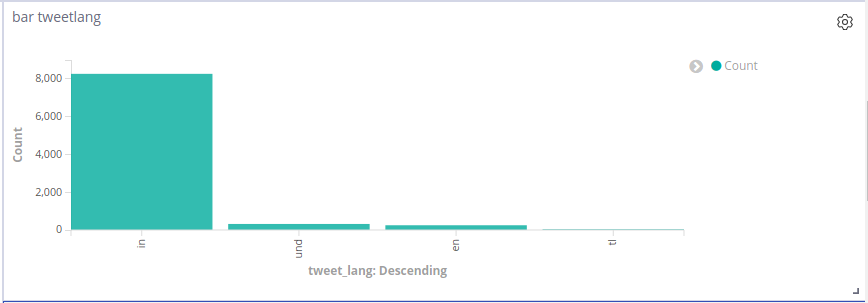
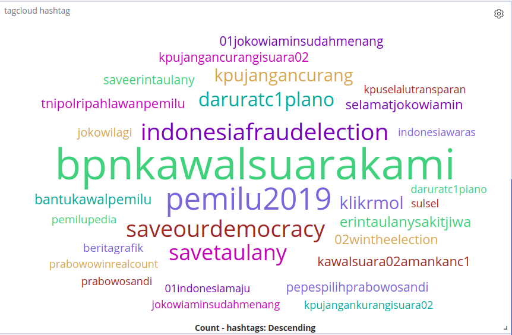
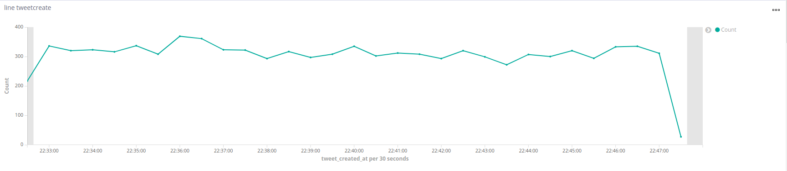
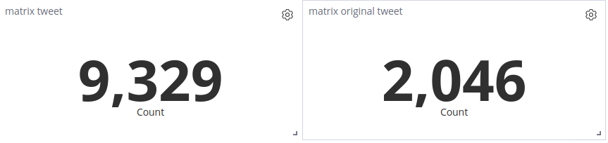
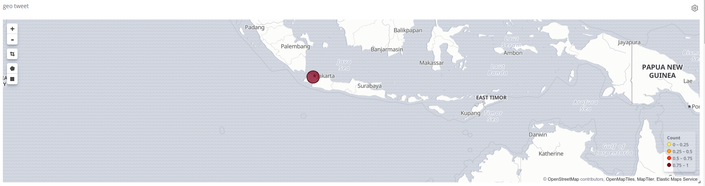

# Twitter Data Visualization
Data pipeline for Twitter (ETL) using the elastic stack (ELK)

Repositori ini hanya fokus pada visualisasi yang terdapat pada data twitter. Ditambah dengan penggunaan container (Docker) untuk mempermudah proses development. Tutorial ini merupakan pengembangan dari tutorial yang sudah dibuat oleh [melvynator](https://github.com/melvynator/ELK_twitter)


### Requirement
1. Docker
2. docker-compose
1. Elasticsearch 6.7.1
1. Kibana 6.7.1
1. Logstash 6.7.1


##### config logstash.conf
daftar untuk mendapatkan token dari twitter: https://dev.twitter.com/resources/signup


```yaml
input {
  twitter {
      consumer_key => "<YOUR_CONSUMER_KEY>"
      consumer_secret => "<YOUR_CONSUMER_SECRET>"
      oauth_token => "<YOUR_OAUTH_TOKEN>"
      oauth_token_secret => "<YOUR_OAUTH_TOKEN_SECRET>"
      keywords => [ "jokowi", "prabowo", "menang"]
      full_tweet => true
      type => "tweet"
  }
}
```

pastikan data store menuju ke address elasticsearch pada docker ::: "hosts => [ "elasticsearch:9200" ]"

Pastikan juga nama file template untuk mapping data di elasticsearch sudah benar :::  "template => "/logstash_dir/elasticsearch_mapping_settings.json""
```yaml
output {
    elasticsearch {
      hosts => [ "elasticsearch:9200" ]
      index => "twitter"
      document_type => "doc"
      document_id => "%{[tweet_id]}"
      template => "/logstash_dir/elasticsearch_mapping_settings.json"
      template_name => "twitter"
    }
}
```


### Instalation 
1. git clone
1. cd visualization_elk_twitter
1. docker-compose up


### Visualization
1. [line chart](chart/sample_line.md)
1. [matrix](chart/sample_matrix.md)
1. [geo](chart/sample_geo.md)
1. [area](chart/sample_area.md)
1. [tagcloud](chart/sample_tagcloud.md)
1. [bar chart](chart/sample_bar.md)


## Example visualization











### Export / Import data elasticsearch
Ketika kalian sedikit kesulitan atau males untuk membuat akun developer di twitter, teman-teman bisa menggunakan data yang sudah saya kumpulkan beberapa jam menggunakan [elasticsearch-dump](https://github.com/taskrabbit/elasticsearch-dump). Dengan cara ini teman-teman tidak perlu lagi menggunakan logstash, tinggal cukup fokus pada cara memvisualikasikannya di kibana.

```commandline
# Import data from file to elasticsearch
elasticdump \
  --input "dump_twitter_mapping.json" \
  --output=http://localhost:9200/twitter

# Export ES data to elasticsearch
elasticdump \
  --input "dump_twitter_data.json" \
  --output=http://localhost:9200/twitter
```


#### Ressources:

Thanks to stackoverflow community and Elastic community for the answer provided.

https://github.com/melvynator/ELK_twitter

https://www.elastic.co/guide/en/elasticsearch/reference/6.0/docker.html

https://www.codementor.io/samueljames/using-docker-with-elasticsearch-logstash-and-kibana-elk-dzucc3c94

https://www.elastic.co/guide/en/logstash/current/introduction.html https://www.elastic.co/guide/en/elasticsearch/reference/current/index.html